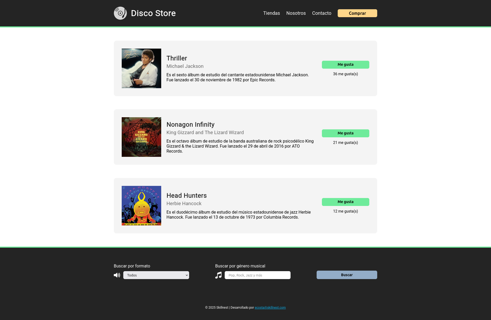

# 🎧 Disco Store

## Proyecto base HTML + CSS + JS

Este repositorio contiene la estructura y recursos necesarios para desarrollar una página web estática llamada **Disco Store**, diseñada como ejercicio práctico o evaluación sumativa. El objetivo es replicar un *mockup* de referencia utilizando tecnologías básicas del desarrollo web: **HTML**, **CSS** y **JavaScript**.

## 📁 Estructura de carpetas

```
.
├── resources/
│   ├── images/
│   ├── mockups/
│   │   ├── mockup-01.png
│   │   └── mockup-02.png
│   └── video/
│       └── recording.mp4
└── README.md
```

## 🎯 Objetivo general

Construir un sitio web estático con diseño responsivo básico que simule una tienda de discos, respetando los estilos y estructura del **mockup entregado**.



Usa esta imagen como referencia visual durante el desarrollo del proyecto. Debes respetar el diseño, distribución de elementos, colores y tipografías.

## ✅ Requisitos técnicos

- Utilizar **Flexbox** para estructurar los componentes principales (navbar, tarjetas, formulario).
- Incluir la fuente **Roboto** desde [Google Fonts](https://fonts.google.com/specimen/Roboto).
- Reproducir fielmente el diseño de los mockups en `resources/mockups/`.
- El archivo `index.html` debe vincular correctamente con `style.css` y `script.js`.
- Las imágenes deben almacenarse en `static/images/`.
- Mantener una estructura semántica en el HTML (`<nav>`, `<form>`, `<main>`, `<section>`, etc. cuando corresponda).
- Comentar el código cuando sea necesario.
- Mantener indentación y orden.

## 🖼️ Elementos a replicar

- Barra de navegación con logo y enlaces.
- Tarjetas de discos (imagen + nombre + artista + descripción + botón de "Me gusta").
- Pie de página con formulario de búsqueda (género y formato).
- Diseño con fondo oscuro y acentos en colores.

## ⚙️ Funcionalidades con JavaScript

| Función                     | Descripción                                                                                            |
| --------------------------- | ------------------------------------------------------------------------------------------------------ |
| **Botón "Me gusta"**    | Aumenta el contador de likes al hacer clic. Usa la función `darMeGusta(id)`.                              |
| **Botón "Comprar"**      | Al hacer clic, el botón desaparece (`remove()`), usando `eliminarBoton()`.                             |
| **Selector de formato** | Al seleccionar una opción, se muestra un `alert()` con el formato elegido, mediante `buscarFormato()`. |

Todas estas funciones deben estar definidas en el archivo `static/js/script.js`. Puedes modificarlas o extenderlas, pero deben cumplir los comportamientos indicados.

## 🧪 Recursos incluidos

- `style.css`: contiene un `reset` de estilos.
- `script.js`: incluye `console.log("Hello JS!")` para probar conexión JS.
- `mockups/`: imágenes que muestran el resultado esperado del proyecto.
- `video/`: video que muestra las interacciones esperadas (funcionalidades JS).
- `resources/images/`: imágenes decorativas (íconos, carátulas, etc.).

## 🎨 Paleta de colores utilizada

| Descripción                        | Color            | Hex       |
| ---------------------------------- | ---------------- | --------- |
| **Color principal oscuro** (fondo) | Gris casi negro  | `#242424` |
| **Color de borde/acento verde**    | Verde neón suave | `#6feb9b` |
| **Color de botones secundarios**   | Amarillo claro   | `#ffd68a` |
| **Color de botones formulario**    | Azul grisáceo    | `#93adc8` |
| **Color de texto general**         | Blanco           | `#fff`    |
| **Color de subtítulos**            | Gris medio       | `#6a6a6a` |
| **Color de tarjetas fondo**        | Gris claro       | `#f4f4f4` |

### Colores: uso con variables CSS (`:root`)

```css
:root {
    --color-fondo-oscuro: #242424;
    --color-verde-acento: #6feb9b;
    --color-amarillo-boton: #ffd68a;
    --color-azul-formulario: #93adc8;
    --color-blanco: #fff;
    --color-gris-subtitulo: #6a6a6a;
    --color-gris-claro: #f4f4f4;
    --color-rojo-debug: #ff2e2e;
}

/* Ejemplo de uso */
.navbar {
    background-color: var(--color-fondo-oscuro);
}
```

## 🚀 Instrucciones para comenzar

1. Clonar o descargar este repositorio.
2. Abre el proyecto con tu editor (por ejemplo, VS Code).
3. Asegúrate de vincular correctamente `style.css` y `script.js` desde `index.html`.
4. Reemplaza el contenido o ajusta estilos respetando la estructura base.
5. Visualiza tu avance abriendo `index.html` en el navegador.

---

### 🧩 Extensiones recomendadas para VS Code

| Extensión                                                                                                    | Descripción                                                                                                 |
| ------------------------------------------------------------------------------------------------------------ | ----------------------------------------------------------------------------------------------------------- |
| [**Code Runner**](https://marketplace.visualstudio.com/items?itemName=formulahendry.code-runner)          | Ejecuta fragmentos de código (JS, Python, etc.) directamente dentro de VS Code. Ideal para pruebas rápidas. |
| [**CSS Peek**](https://marketplace.visualstudio.com/items?itemName=pranaygp.vscode-css-peek)              | Permite hacer clic en clases CSS desde HTML y navegar directamente a su definición.                         |
| [**Error Lens**](https://marketplace.visualstudio.com/items?itemName=usernamehw.errorlens)                | Muestra los errores y advertencias directamente en el editor (resaltado visual inmediato).                  |
| [**Live Server**](https://marketplace.visualstudio.com/items?itemName=ritwickdey.LiveServer)              | Abre tu proyecto en el navegador y actualiza automáticamente al guardar.                                    |
| [**Material Icon Theme**](https://marketplace.visualstudio.com/items?itemName=PKief.material-icon-theme) | Cambia los íconos del explorador de archivos por otros más visuales y modernos.                             |

Puedes buscarlas directamente desde el panel de extensiones en VS Code (ícono de bloques en la barra lateral) o instalar usando los enlaces.